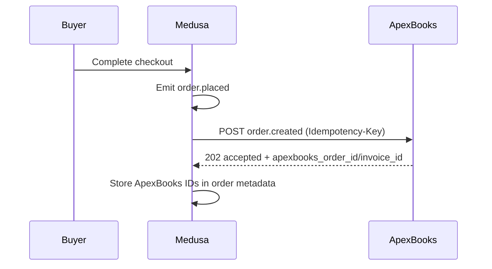
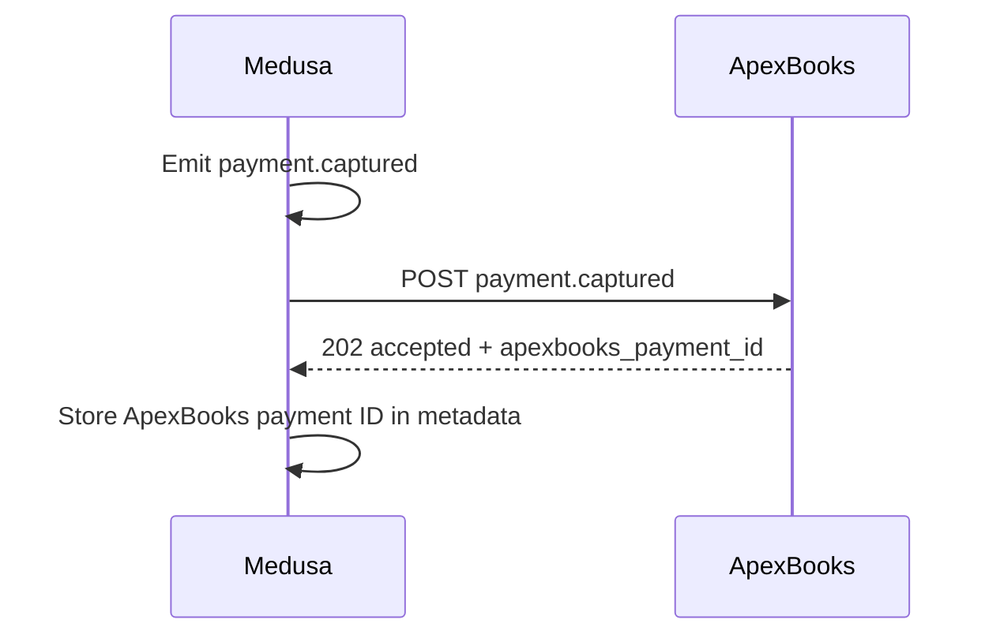
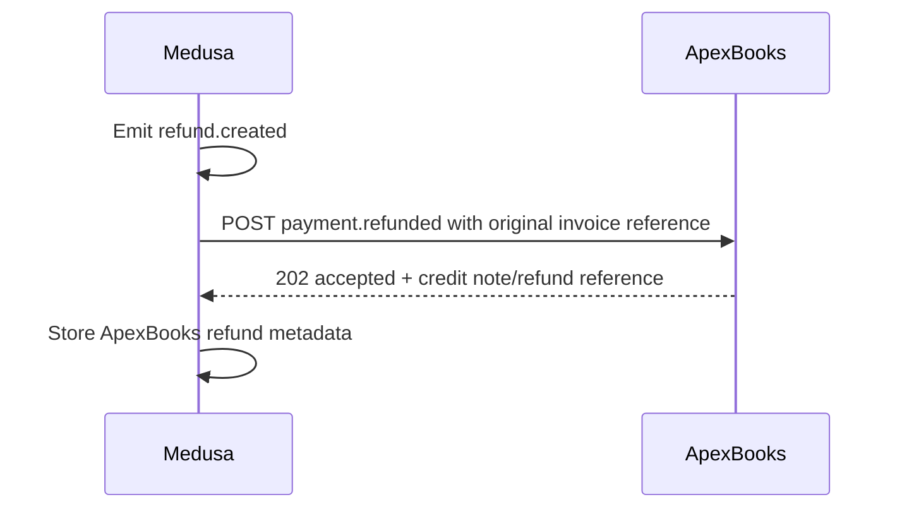
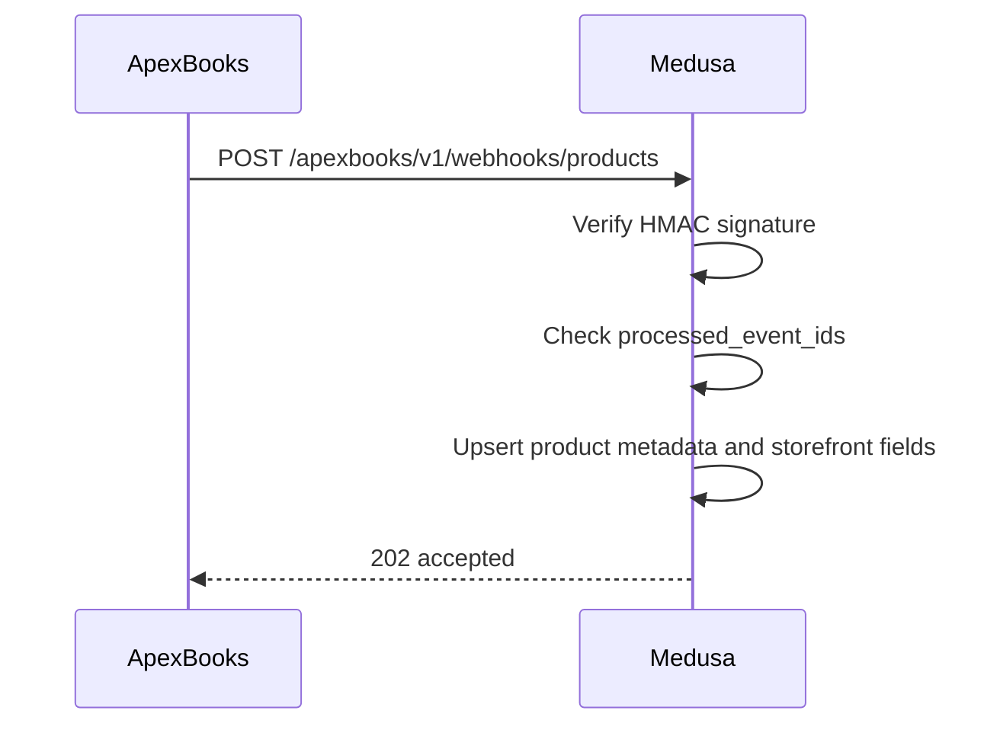
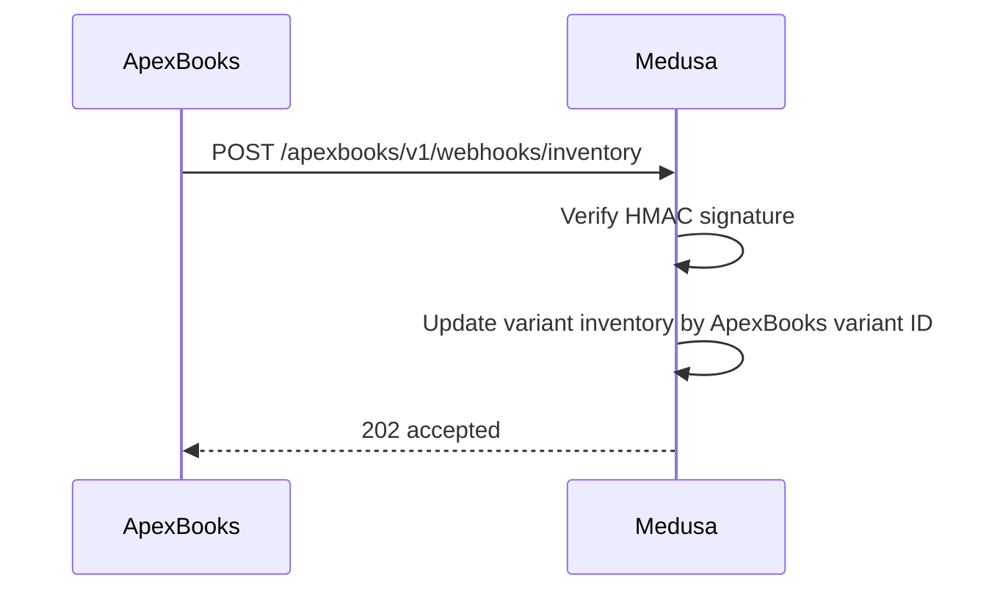
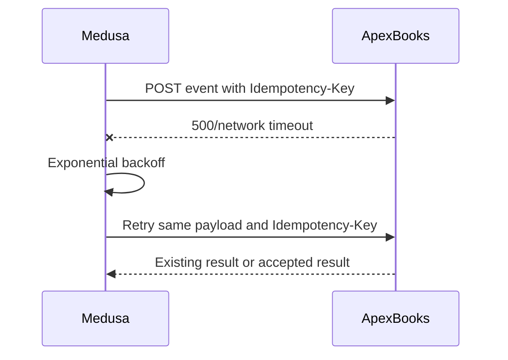

# ApexBooks Integration Contract v1 - Sequence Diagrams

## Order Created

## Payment Captured

## Refund Created

## Product Update From ApexBooks

## Inventory Update From ApexBooks

## Retry And Idempotency

