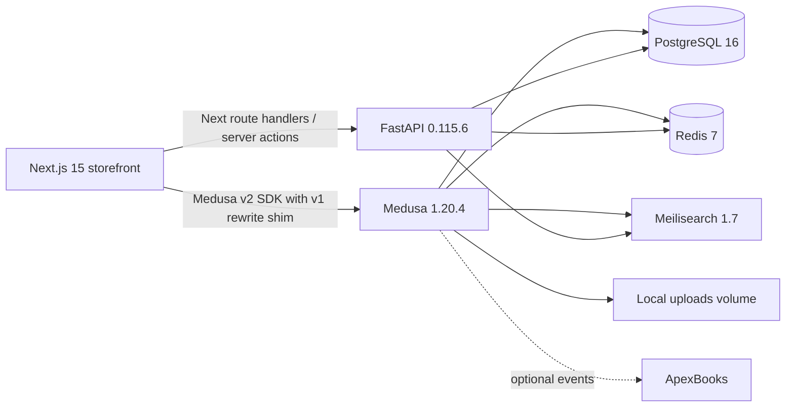

# Cartunez Repository Audit and Repair Plan

**Audit date:** 2026-07-27  
**Scope:** Phase 1 only. No runtime architecture or production data has been changed.

## Executive summary

The repository is not production-ready. It contains three application implementations: a
Medusa v1 commerce backend, a FastAPI automotive/content backend, and a Next.js storefront,
plus an abandoned Vite storefront. The most important blocker is a version split: the
storefront is the Medusa **v2** starter and uses the v2 SDK/types, while the commerce service
is Medusa **v1.20.4**. A large interception layer rewrites v2 requests and response shapes to
v1 at runtime. That adapter is incomplete, removes query fields, mutates SDK responses, and
cannot provide a reliable cart, checkout, authentication, pricing, or order contract.

Vehicle ownership is also duplicated. FastAPI has make/model/year/variant tables, while
Medusa has a second set plus product compatibility tables and endpoints. Despite a comment
claiming FastAPI is the source of truth, fitment remains implemented in Medusa and is absent
from FastAPI. Neither implementation has the required generation, engine, normalized fuel
and transmission entities, year ranges, active state, robust uniqueness, or complete fitment
API.

The checked-in deployment configuration can start infrastructure in principle, but cannot
currently produce reproducible application images: Medusa has no lockfile, dependency
installation has an unsatisfied TypeORM peer dependency, its image patches installed
framework source files, and the storefront production build downloads Google fonts. Docker
is unavailable in the audit environment, so Compose and migration runtime validation remain
outstanding.

## Repository and architecture map

| Area | Location | Observed stack and purpose |
| --- | --- | --- |
| Storefront | `frontend/` | Next.js 15.5.18 App Router, React 19.0.5, TypeScript 5.3 declaration, Medusa JS SDK/types 2.17.0, npm lockfile |
| Legacy storefront | `frontend-old/` | Vite 6, React 18; apparently superseded but still tracked, including a dependency tree |
| Commerce | `backend/cartunez-medusa/` | Medusa 1.20.4, Medusa Admin 7.1.18, Express, TypeORM, Redis event/cache, Meilisearch, local files, manual payment and fulfillment |
| Automotive/content API | `backend/cartunez-api/` | FastAPI 0.115.6, Pydantic 2.10.4, async SQLAlchemy 2.0.36/asyncpg, Alembic 1.14.1 |
| Data | Compose plus both backends | One PostgreSQL 16 database is shared by both applications; Redis 7 and Meilisearch 1.7 are shared services |
| Edge/deployment | `backend/docker-compose.yml`, `backend/nginx/`, root scripts | Docker Compose, multi-stage images, host nginx and shell deployment scripts |

### Routing and page inventory

The active storefront uses the Next.js App Router under a country-code segment and route
groups. Present pages include home, store, category, collection, product details, cart,
checkout, order confirmation/transfer, account/login/profile/addresses/orders, installation,
support, privacy, returns, and terms. Missing dedicated routes include search results, brand
index/detail, model index/detail, vehicle selection, compatible products, about, contact,
shipping policy, and a separately addressable registration page (registration is a mode of
the account login UI).

FastAPI exposes vehicles, dealers, bulk enquiries, installation, leads, support, blogs,
reviews, analytics, social media, gallery, and chatbot routes. It has only one Alembic
revision (`001_initial`). Medusa has three custom TypeORM migrations for duplicate vehicle
tables, ApexBooks, and integration tables.

## Technology and configuration audit

### Commerce and authentication

- Medusa owns the standard v1 product, variant, category, collection, pricing, region,
  inventory, customer, cart, shipping, payment, and order entities.
- Customer/admin authentication is Medusa's JWT/session system. Storefront auth calls are
  made through a v2 SDK against a v1 backend, so behavior is not contract-safe.
- FastAPI has no user model or JWT issuance flow. Automotive and content mutations use a
  static `X-API-Key`; configuration reads it directly from the process environment at import
  time rather than through the settings model.
- Several operational read endpoints expose leads, support tickets, analytics, installations,
  and enquiries; authorization varies by router and must be verified endpoint-by-endpoint.

### Payments, fulfillment, files, search, and email

- Only Medusa's manual payment and manual fulfillment plugins are actually configured.
  Razorpay and Stripe variables are documented but no corresponding provider is installed.
  The storefront includes Stripe/Medusa Payments UI paths that therefore cannot be assumed
  to work.
- Local file storage is configured and persisted as a Docker volume. S3 variables are
  examples only; there is no S3 provider configuration.
- Medusa's Meilisearch plugin indexes a small product projection. FastAPI also creates a
  Meilisearch client for search/chatbot behavior. Search ownership and index contracts are
  not documented, and automotive fitment fields are not in the product index.
- SMTP variables are examples only. No notification/email provider is configured in Medusa.
- ApexBooks has custom inbound routes, event subscribers, mapping tables, retry logic, and an
  integration UI. Its extensive static tests do not substitute for commerce integration
  tests.

### Environment configuration

There are three overlapping examples plus a tracked `frontend/.env.production`. Names are
inconsistent (`NEXT_PUBLIC_API_URL` vs `NEXT_PUBLIC_API_BASE_URL`, `SMTP_PASS` vs
`SMTP_PASSWORD`, `GOOGLE_SITE_VERIFICATION` vs `NEXT_PUBLIC_GOOGLE_VERIFICATION`). Compose
contains insecure fallback passwords/secrets and a real-looking publishable key as a default.
The public Medusa URL alternates between the storefront origin and `shop.cartunez.in`, while
the internal URL is supplied only at runtime. Required variables such as cookie security,
admin URL, frontend payment keys, Medusa URL for FastAPI validation, monitoring, and trusted
proxy behavior are incomplete or undocumented.

## Data model and API contract findings

### Current automotive schema

FastAPI currently models:

`VehicleMake -> VehicleModel -> VehicleYear -> VehicleVariant`

Medusa independently models:

`VehicleMake -> VehicleModel -> VehicleYear -> VehicleVariant -> ProductVehicleCompatibility`

Names and columns differ (`vehicle_year_id` versus `year_id`, `engine` versus `engine_type`,
plural versus singular table names). FastAPI lacks fitment entirely. Medusa compatibility
stores `product_id` as UUID even though Medusa IDs are string identifiers, has no product
foreign key, does not support a product variant, and has no uniqueness constraint. Product
extension metadata adds a third representation via free-form make/model/compatibility values
and arrays of automotive IDs.

### Target ownership decision

1. **Medusa remains the system of record for commerce**: products/variants, taxonomy,
   prices/regions/currencies, inventory/locations, customers/auth, carts, promotions,
   shipping, payments, orders, refunds, fulfillment, files, and commerce admin.
2. **FastAPI becomes the system of record for automotive catalog and fitment**: brands,
   models, generations, years/ranges, variants, engines, fuel/transmission vocabularies,
   specifications, normalization/import, and links to stable Medusa product/variant IDs.
3. FastAPI stores only opaque Medusa IDs plus validation status/timestamps, never replicated
   product, price, inventory, customer, cart, or order data. Mutations validate IDs through
   the Medusa Store/Admin API using a server-only credential and bounded timeout.
4. Remove Medusa vehicle routes/models only after a non-destructive migration copies and
   reconciles their data into FastAPI-owned tables. During rollout, dual reads may be used;
   dual writes are prohibited.
5. Publish a versioned OpenAPI fitment contract. The frontend sends a selected automotive
   ID to FastAPI and receives product IDs plus compatibility status; it then retrieves all
   commerce details and authoritative prices/availability from Medusa.

### Required safe migration strategy

1. Inventory both existing schemas and record counts in a production snapshot.
2. Add new normalized FastAPI tables and indexes in additive migrations; do not edit the
   already-applied initial revision.
3. Backfill normalized brands/models/generations/variants using deterministic normalized
   keys and retain a legacy-ID mapping table.
4. Import Medusa compatibility and product metadata into `product_fitments`; quarantine
   unmatched IDs instead of dropping them.
5. Validate referenced Medusa products/variants in batches and record validation results.
6. Compare counts and representative queries, then move frontend reads to FastAPI behind a
   feature flag.
7. Make old Medusa compatibility writes read-only, observe, and only drop old tables in a
   later independently approved migration after rollback retention.

The target fitment table needs opaque product and optional product-variant IDs, optional
brand/model/generation/vehicle-variant/engine/fuel/transmission references, inclusive year
range with a check constraint, exact/compatible/universal enum, notes, active state, audit
timestamps, and a duplicate-prevention strategy that handles nullable dimensions (for
PostgreSQL 15+, `NULLS NOT DISTINCT` or a normalized fingerprint). Index the two Medusa IDs,
active/status, each automotive FK, and year range; use restrictive deletion for shared
vocabularies and soft deactivation for referenced catalog records.

## Prioritized issue register

### Critical

| Location | Root cause | User impact | Proposed fix | Dependencies / risks |
| --- | --- | --- | --- | --- |
| `frontend/src/lib/config.ts`, `frontend/package.json`, `backend/cartunez-medusa/package.json` | Medusa v2 storefront SDK/types are pointed at Medusa v1 and patched through request/response rewriting | Product fields, auth, cart, discounts, payment, checkout, and orders can silently diverge or fail | Choose one supported major version. Lowest-risk short-term path is a v1-compatible typed client/storefront adapter; alternatively perform a planned Medusa v2 migration. Delete the global monkey patch after contract tests pass | This is the largest change; preserve existing production data and validate every checkout step |
| Both vehicle model trees and route sets | Automotive data and fitment responsibility is duplicated; actual implementation contradicts the stated source of truth | Vehicle selection cannot reliably return compatible products and admins can create divergent records | Add normalized fitment to FastAPI, backfill, switch reads, then retire Medusa copies | Requires reconciliation and a reversible data migration |
| `backend/cartunez-medusa/package.json`, missing lockfile | Medusa dependencies are not reproducible and `npm install` fails on TypeORM peer constraints (`medusa-extender` expects 0.2 while Medusa uses 0.3) | Backend cannot be reliably installed, built, patched, or deployed | Remove/replace `medusa-extender` registration with native Medusa v1 conventions, pin compatible dependencies, generate and commit a lockfile | Refactor service registration and run real Medusa integration tests |
| `backend/cartunez-medusa/Dockerfile` | Image mutates framework files in `node_modules` to bypass provider and cookie behavior | Security and commerce behavior differs from upstream and can break after any install | Remove patches and fix configuration/provider registration through supported Medusa APIs | Must validate admin sessions, providers, checkout, and proxy TLS behavior |
| Repository-wide tests | No FastAPI tests, no storefront tests, and no real commerce journey tests; the default Medusa test is static source inspection | Regressions in all required business flows are undetected | Establish database-backed API tests, Medusa integration tests, component tests, and Playwright E2E for vehicle-to-checkout initiation | Needs isolated Postgres/Redis/Meilisearch fixtures and deterministic seed data |

### High

| Location | Root cause | User impact | Proposed fix | Dependencies / risks |
| --- | --- | --- | --- | --- |
| FastAPI vehicle models/migration | Missing generation, engine, normalized fuel/transmission, year range, fitment, active status, composite uniqueness and key FK indexes | Required filtering and compatibility cannot be represented safely | Add normalized additive schema and repository/service layer with cursor or bounded offset pagination | Data normalization rules must be agreed before import |
| FastAPI vehicle API | Only create/read and one search endpoint exist; no updates, most deletes, bulk import, fitment operations, compatible lookup, sorting, envelope metadata, or Medusa validation | Automotive admin and vehicle journeys are incomplete | Implement versioned CRUD/import/fitment endpoints with consistent responses and admin authorization | Requires target schema and Medusa integration credentials |
| Medusa vehicle HTTP routes | Mutation routes have no explicit auth/validation and report every failure as 500; compatibility writes delete then replace | Unauthorized fitment changes and data loss/races are possible | Disable writes during migration, require Medusa admin auth, validate bodies, use correct errors and transaction-safe upsert | Route mounting/auth behavior needs runtime verification |
| Payment configuration and checkout | Only manual provider is installed while UI/environment imply Stripe/Razorpay; no verified shipping/payment E2E | Customers may be unable to pay or may see unsupported methods | Select a production provider, implement official plugin/webhooks/idempotency, configure fulfillment and test completion/failure | Merchant credentials and webhook ingress are external dependencies |
| Docker/Compose secrets | Compose defaults permit weak known database, Redis, JWT, cookie and search secrets | Accidental production deploy is insecure | Require secrets with Compose interpolation errors; separate dev defaults into an override; add secret rotation documentation | Existing deployments need coordinated rotation |
| Local file uploads | Local filesystem is the only configured provider | Images are tied to one container/host and can be lost or unavailable in scaled deployment | Configure supported object storage and migration/copy procedure; keep local only in development | Requires bucket/CDN credentials and URL migration |
| FastAPI health/error/logging | Health never checks dependencies, validation details are discarded, catch-all does not log, request IDs are accepted but not generated/propagated | Orchestration reports false health and diagnosis is poor | Add liveness/readiness, structured safe logs, request-ID middleware and standard error envelope | Avoid logging PII from leads/support/payment data |
| Frontend missing routes/state | No complete vehicle selector or compatibility result routes/state; dedicated search/brands/models and several content pages are absent | Major journeys in the brief do not exist | Implement URL-synchronized, SSR-safe selection and missing routes after fitment contract stabilizes | Depends on FastAPI APIs and Medusa version decision |
| Tracked production environment | `frontend/.env.production` embeds deployment-specific public configuration and a real-looking publishable key | Environments are coupled and key rotation/config drift are difficult | Remove deployment values from source, use build/deploy secret configuration, retain documented placeholders | Public keys are not secrets, but should still be environment-managed |

### Medium

| Location | Root cause | User impact | Proposed fix | Dependencies / risks |
| --- | --- | --- | --- | --- |
| FastAPI initial migration | One monolithic migration diverges from models (for example installation dealer relationship); UUID defaults depend on application inserts | Fresh and existing databases can behave differently | Compare metadata to a real migrated DB and add corrective revisions plus migration tests | Never rewrite revision already deployed |
| FastAPI session dependency | Every request commits even read-only work and repositories are embedded directly in routers | Unnecessary transactions and difficult unit testing | Use explicit unit-of-work boundaries for mutations and repository/service separation | Mechanical but broad refactor |
| FastAPI CORS/settings | Defaults include API origin and broad local origins; settings parsing code assumes a string despite typed list | Misconfiguration and unnecessary credentialed origins | Validate explicit environment-specific origins and fail closed in production | Deployment origins must be enumerated |
| Rate limiter | Redis initialization errors and runtime failures fail open; client IP ignores trusted proxy rules; timestamp member can collide | Abuse controls are unreliable | Initialize in lifespan, use atomic script, configure trusted proxy/client key strategy, expose degraded readiness | Decide whether degraded Redis blocks mutations |
| Frontend build | `next/font` fetches Google assets during build | Offline/restricted production builds fail | Self-host licensed font assets or use robust system font stack | Font asset licensing and visual regression review |
| Search | Product and automotive search are split and product index omits SKU/price/availability/fitment dimensions | Filters cannot meet the requested behavior | Define one product-search projection sourced from Medusa plus FastAPI ID prefilter/intersection | Reindexing and eventual-consistency design required |
| Seed/import scripts | Numerous direct-SQL, destructive reset, scrape, and silent-catch scripts bypass domain services | Seed data can violate Medusa invariants and failures go unnoticed | Classify scripts, remove production access from destructive utilities, use supported services/workflows and explicit logging | Preserve necessary one-time import history separately |
| Admin UX | Commerce admin exists, but automotive management is API-key-only and integration UI is custom HTML | Automotive administrators lack secure, consistent management | Add a separately authenticated automotive admin or a Medusa admin extension calling FastAPI server-side | Identity/role mapping must be designed |
| Observability | No Sentry hook, metrics, tracing, readiness, or documented redaction policy | Production failures and latency cannot be investigated safely | Add structured logs/metrics/traces and optional error monitoring configuration | Data retention and PII policy required |

### Low

| Location | Root cause | User impact | Proposed fix | Dependencies / risks |
| --- | --- | --- | --- | --- |
| Root documentation | Many contradictory “ready/deployed/final” reports obscure current truth | Operators may follow obsolete instructions | Archive superseded reports and replace with one versioned README/runbook | Confirm whether reports have compliance value before removal |
| `frontend-old/` | Superseded application and dependencies remain tracked | Larger repository and unclear source of truth | Confirm no deployment references, then archive/remove it | Preserve history with a tag if needed |
| Source encoding/comments | Several Python files contain BOM/mojibake separators | Poor readability/tool behavior | Normalize UTF-8 without BOM | Avoid noisy unrelated diffs |
| Tooling | No Python format/lint/type/test configuration and frontend uses deprecated `next lint` | Inconsistent CI/local quality checks | Add Ruff, mypy/pyright, pytest, ESLint CLI and CI scripts | Establish an incremental baseline rather than hiding errors |

## Baseline command results

Commands were executed from the repository root unless a working directory is shown.

| Command | Result | Notes |
| --- | --- | --- |
| `node --version` | Pass | `v24.15.0`; containers declare Node 20 |
| `npm --version` | Pass | `11.4.2` |
| `python --version` | Pass | `3.14.4`; FastAPI image declares Python 3.12 |
| `npm ci` (`frontend/`) | Pass | 598 packages installed from lockfile |
| `npm run lint` (`frontend/`) | Pass | No warnings/errors; Next reports `next lint` is deprecated |
| `npx tsc --noEmit` (`frontend/`) | Pass | No diagnostics |
| `npm run build` (`frontend/`) | Fail | Webpack cannot download Inter and Barlow Condensed through `next/font` |
| `python -m pip install -r requirements.txt` (`backend/cartunez-api/`) | Environment-blocked | Package index tunnel returned HTTP 403 |
| `python -m compileall -q app` (`backend/cartunez-api/`) | Pass | Python sources compile |
| `python -m pytest` (`backend/cartunez-api/`) | Fail | Exit 5: zero tests collected |
| `alembic heads` (`backend/cartunez-api/`) | Environment-blocked | Alembic executable is unavailable because dependencies could not be installed |
| `npm install` (`backend/cartunez-medusa/`) | Fail | ERESOLVE: TypeORM peer conflict between Medusa/TypeORM 0.3 and `medusa-extender` 0.2 requirement |
| `npm run typecheck` (`backend/cartunez-medusa/`) | Fail | With available TypeScript, deprecated `baseUrl` is an error; dependencies were not installed reproducibly |
| `npm run build` (`backend/cartunez-medusa/`) | Fail | Same TypeScript/configuration blocker |
| `npm run test:apexbooks` (`backend/cartunez-medusa/`) | Pass | Static ApexBooks source checks only, not a runtime integration test |
| `docker --version` / `docker compose version` | Environment-blocked | Docker is not installed; Compose config, images, services and migrations were not run |

No frontend unit/E2E suite, FastAPI test suite, Medusa commerce test suite, Python formatter,
Python linter, or Python type checker is configured. Database migration execution was not
attempted without a disposable PostgreSQL service.

## Phased implementation plan and gates

### Phase A — Reproducible baseline and version decision

1. Add CI matrices matching Node 20 and Python 3.12.
2. Resolve Medusa dependencies without `--legacy-peer-deps`, commit a lockfile, remove image
   patches, and make all three applications build offline/reproducibly.
3. Record a decision: migrate commerce to Medusa v2 or make the storefront genuinely v1.
4. Add smoke tests for current products, regions, cart, customer auth and health endpoints.

**Gate:** clean installs, lint, type checks, builds and smoke tests pass before schema work.

### Phase B — Automotive schema and FastAPI foundation

1. Add typed settings validation, lifespan-managed clients, request IDs, structured logging,
   readiness, and consistent errors.
2. Add normalized, additive automotive/fitment migrations with uniqueness and indexes.
3. Introduce repositories/services, consistent pagination/sort/filter contracts, name/slug
   normalization, and transaction boundaries.
4. Add admin authorization and ownership/role tests before enabling mutations.

**Gate:** Alembic upgrade/downgrade on empty and production-shaped fixtures; FastAPI lint,
type check and tests pass.

### Phase C — Medusa integration and migration

1. Add a server-only Medusa client in FastAPI with timeout, retries only for safe operations,
   validation caching, and explicit error mapping.
2. Implement fitment CRUD/bulk import/product-to-vehicle/vehicle-to-product endpoints.
3. Backfill duplicate Medusa vehicle data with reconciliation reports and switch reads.
4. Disable duplicate Medusa writes and remove them only after an observation window.

**Gate:** data reconciliation is lossless; contract and authorization tests pass; no dual
writes remain.

### Phase D — Commerce correctness

1. Repair region/pricing/inventory/location seed data using Medusa services.
2. Configure supported shipping, payment, webhook idempotency, fulfillment, notification and
   object storage providers.
3. Test product retrieval, cart lifecycle, stock validation, shipping, payment failure/success,
   order completion, admin auth and admin product management.

**Gate:** database-backed Medusa integration suite and migration checks pass.

### Phase E — Storefront journeys

1. Replace the global SDK rewrite with a version-correct typed integration.
2. Implement missing search/brand/model/vehicle/compatibility and policy routes.
3. Add SSR-safe selected-vehicle state, URL filter synchronization, compatibility labels,
   product variant availability, and complete loading/empty/error/accessibility states.
4. Verify secure cookie-based auth, server-authoritative cart totals, checkout idempotency and
   post-order cart cleanup.

**Gate:** component tests and Playwright journey (vehicle -> compatible product -> available
variant -> cart -> checkout initiation) pass on desktop and mobile.

### Phase F — Operations, documentation, and release

1. Split development and production Compose, require secrets, add health/readiness checks and
   startup migration jobs with backups/rollback.
2. Add monitoring, redaction policy, dependency audit, restore drill and performance baselines.
3. Replace conflicting root reports with one architecture/setup/deploy runbook and Mermaid
   diagram; document APIs, environments, migrations, seeds and limitations.
4. Run the full verification matrix in clean CI and a production-like staging environment.

**Gate:** all required checks pass; payment/webhook and backup/restore are proven in staging;
remaining limitations have explicit owner and release acceptance.

## Immediate next slice

The next implementation should not start with UI patches. It should first resolve the Medusa
major-version decision and reproducible dependency installation, because every product/cart/
checkout change depends on that contract. In parallel only after that decision, the additive
FastAPI automotive schema can be designed against a sampled production-data inventory. No
destructive migration or removal of the legacy frontend/vehicle tables should occur until
that inventory and rollback plan are approved.
